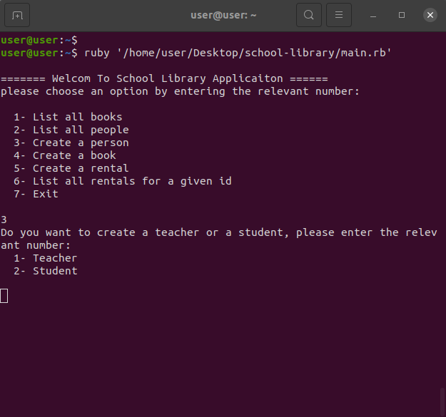

# OOP School library

> This project is a Ruby based application, it demonstartes OOP concept of the Ruby language through creating classes and constructors, in addition to other features like methods, inheritance and more.

## Screenshot

## Getting started
  Run the following commands on the terminal your local machine:

  - `git clone https://github.com/Rayan84/school-library.git`
  - `cd school-library`
  - `ruby the/path/to/main.rb`

  To run the tests:

  - `Run gem install rspec to install RSpec`
  - `Run rspec spec --format documentation to run the tests`

## Authors

👤 **Rayan Rassam**

- GitHub: [@Rayan84](https://github.com/Rayan84)
- Twitter: [@Rayan65096267](https://twitter.com/Rayan65096267)
- LinkedIn: [Rayan Rassam](https://www.linkedin.com/in/rayan-rassam/)

👤 **Mahbub Alam**
- GitHub: [@mahbubul14](https://github.com/mahbubul14)
- Twitter: [@twitterhandle](https://twitter.com/mahbubul_14)
- LinkedIn: [LinkedIn](https://www.linkedin.com/in/mahbubul14/)

## 🤝 Contributing

Contributions, issues, and feature requests are welcome!

Feel free to check the [issues page](../../issues/).

## Show your support

Give a ⭐️ if you like this project!